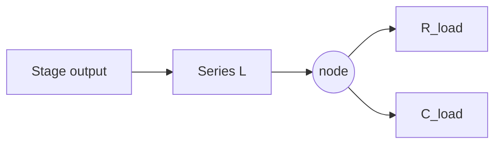

## The core idea

A resistively-loaded stage rolls off at $1/(2\pi R C)$. Adding a **series inductor** $L$ between the load resistor and the capacitance creates a resonance that pushes the pole out, extending bandwidth without burning more current. This is *shunt peaking*.

## Shunt peaking

Define the peaking factor:

$$
m = \frac{R^2 C}{L}
$$

The transfer function becomes a second-order response whose bandwidth extension and peaking depend only on $m$:

- $m = \infty$ (no inductor): plain $RC$, bandwidth $\times 1.0$
- $m \approx 1.41$: **maximally flat magnitude** (Butterworth), bandwidth $\times 1.72$, no peaking
- $m \approx 1.0$: maximally flat **group delay**, bandwidth $\times 1.6$, best for PAM4 eye
- $m < 1$: visible peaking and overshoot

The group-delay-flat choice ($m\approx1$) is usually preferred in a PAM4 chain because magnitude peaking that looks harmless in $|S_{21}|$ shows up as ISI in the eye.

## Series peaking & T-coils

Splitting the inductor into two coupled halves around the capacitance (a **T-coil**) isolates the load and pad capacitance and can deliver bandwidth extension factors approaching $\times 2.8$ — the highest-leverage passive technique available, at the cost of needing a well-characterized coupled-inductor model.

## Where it applies

This is why the technique appears in both the **TIA** and the **driver/output** stages — anywhere a resistive load meets a capacitance, peaking buys bandwidth. The trade-off knob ($m$, or equivalently $Q$) is the same; only the absolute $R$, $L$, $C$ values differ per block.

## Takeaways

- One dimensionless number $m = R^2C/L$ sets the entire magnitude/group-delay trade-off.
- Pick $m\approx1$ for clean group delay in signaling chains, not the flashier flat-magnitude $m\approx1.41$.
- T-coils are the strongest passive extension but demand EM-verified models.
