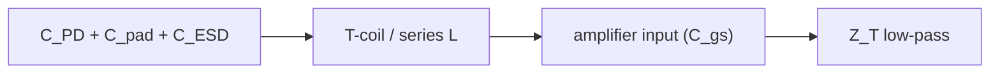

## Why two transfer functions?

A shunt-feedback TIA has an amplifier of voltage gain $-A(s)$ with feedback resistor $R_F$, loaded at the input by the **total input capacitance**

$$
C_{in} = C_{PD} + C_{pad} + C_{ESD} + C_{gs}
$$

i.e. photodiode + pad + ESD + the amplifier's own input capacitance. The signal current $i_{PD}$ and the internal noise sources do **not** see the same network, so they are filtered by **two different transfer functions**:

- **Transimpedance (signal) transfer function** $Z_T(s) = v_{out}/i_{PD}$ — how the *wanted* photocurrent becomes output voltage. This sets gain and bandwidth.
- **Noise transfer function(s)** $H_n(s)$ — how each *internal* noise source reaches the output. The dominant amplifier-voltage-noise source sits in a different place in the network than the signal current, so its path to the output has a fundamentally different frequency shape.

The single most important fact in TIA noise design: **the noise transfer function rises with frequency exactly in the band where the signal transfer function is rolling off.** That mismatch is "noise shaping," and it is what makes high-speed TIAs capacitance-limited rather than resistor-limited.

## 1. The signal transfer function

With a single-pole amplifier of DC gain $A_0$, the closed-loop transimpedance is a second-order low-pass:

$$
Z_T(s) = \frac{-R_F}{1 + \dfrac{s}{\omega_0 Q} + \dfrac{s^2}{\omega_0^2}}
$$

To first order the dominant pole is the $R_F C_{in}$ pole extended by the loop gain:

$$
f_{-3\text{dB}} \approx \frac{A_0+1}{2\pi R_F C_{in}}
$$

The design tension is already visible: you want **large $R_F$** (gain, and as we'll see, low resistor noise) but large $R_F$ kills bandwidth unless loop gain or peaking rescues it. $Z_T$ is the function you flatten for gain and shape for group delay.

## 2. The noise sources and their transfer functions

Refer everything to an **input-referred noise current** $\overline{i_{n,in}^2}\,[\text{A}^2/\text{Hz}]$ — the equivalent current source at the TIA input that, through a *noiseless* TIA, reproduces the real output noise. Säckinger's decomposition has three groups:

**(a) Feedback resistor thermal noise.** $R_F$ injects current noise directly at the summing node, in parallel with the signal:

$$
\overline{i_{n,R_F}^2} = \frac{4kT}{R_F}
$$

It is **white**, and crucially it shares the signal's path, so it is referred to the input *flat* — no shaping. Larger $R_F$ → less of it. This is the "good" noise.

**(b) Amplifier input voltage noise $\overline{v_n^2}$ — the shaped term.** The front-end transistor contributes a series voltage noise

$$
\overline{v_n^2} = \frac{4kT\,\gamma}{g_m} \quad (+\ 1/f \text{ at low frequency})
$$

To refer this *voltage* noise back to an equivalent *input current*, you divide by the impedance looking from the input node to ground — which is dominated by $C_{in}$. That impedance **falls** with frequency ($1/\,\omega C_{in}$), so the referred current **rises**:

$$
\overline{i_{n,v}^2}(f) = \overline{v_n^2}\,\left(\frac{1}{R_F^2} + (2\pi f\,C_{in})^2\right)
$$

The $(2\pi f C_{in})^2$ term is the famous **$f^2$ noise**. It is the amplifier voltage noise being up-converted by the input capacitance. Its transfer function is a high-pass — exactly opposite to $Z_T$'s low-pass.

**(c) Photodiode shot noise.** $\overline{i_{n,PD}^2} = 2qI_{PD}$, signal-dependent, shares the signal path (flat referral).

### Total input-referred PSD

$$
\boxed{\;\overline{i_{n,in}^2}(f) \approx \underbrace{\frac{4kT}{R_F}}_{\text{flat, }\downarrow R_F}
+ \underbrace{\frac{4kT\gamma}{g_m}\left(\frac{1}{R_F^2} + (2\pi f\,C_{in})^2\right)}_{\text{voltage noise, shaped}}
+ \underbrace{2qI_{PD}}_{\text{shot}}\;}
$$

The spectrum therefore has the classic shape: a **white floor** at low frequency (set by $4kT/R_F$ and the $1/f$ corner) and a **rising $f^2$ tail** at high frequency (set by $\overline{v_n^2}\,C_{in}^2$). To compare TIAs honestly you must look at this spectrum out to roughly **2× the bandwidth**, because that rising tail is where most of the integrated noise lives.

## 3. Why total noise is capacitance-limited (the $f^3$ result)

Integrate the PSD over the noise bandwidth to get the total input-referred rms noise current. The flat terms integrate $\propto BW$. But the $f^2$ term integrates as

$$
\int_0^{BW} (2\pi f C_{in})^2\,df \;\propto\; C_{in}^2 \cdot BW^3
$$

So the dominant high-speed contribution grows with the **cube of bandwidth** and the **square of total input capacitance**. Two consequences:

- At 100 GBaud the $C_{in}^2 BW^3$ term dwarfs the resistor term. The TIA is **capacitance-limited**, not resistor-limited.
- $C_{in}$ is the highest-leverage knob in the whole design. Halving $C_{in}$ cuts the dominant noise power 4×. Nothing else moves noise that fast.

> **Important caveat — this scaling holds at *fixed* bandwidth.** The result $\propto C_{in}^2 BW^3$ treats $C_{in}$ and $BW$ as independent. They are not when you swap photodiodes: a real PD changes capacitance **and** the bandwidth of the signal it delivers, and its frequency response sits in the *signal* path but **not** the *noise* path. So "total noise $\propto C_{in}^2$" is the right intuition for an isolated capacitor added to the node, but it is **not** a valid way to rank two different photodiodes. §6 resolves this directly.

This is also where the **noise–bandwidth tradeoff** becomes three-way, because the *same* $C_{in}$ that drives noise also sets $f_{-3\text{dB}}$, and the peaking you add to recover bandwidth also reshapes **group delay**.

## 4. The three-way tradeoff: noise ↔ bandwidth ↔ group delay

| Knob | Helps | Hurts |
|---|---|---|
| ↑ $R_F$ | resistor noise (↓), gain (↑) | bandwidth (↓) |
| ↑ $g_m$ (bigger/faster front-end) | $\overline{v_n^2}$ (↓ via $1/g_m$) | $C_{gs}$ → $C_{in}$ (↑), power (↑) |
| ↓ $C_{in}$ | $f^2$ noise (↓↓), bandwidth (↑) | needs physical isolation (see §5) |
| add peaking (L / T-coil) | bandwidth (↑) without ↑power | group-delay ripple if over-peaked |

The $g_m$ knob is subtle and important: increasing front-end transconductance lowers $\overline{v_n^2}=4kT\gamma/g_m$, but a bigger input device adds $C_{gs}$ to $C_{in}$, which *raises* the $f^2$ term. There is an **optimum input-device size** where these balance — classically when $C_{gs}$ is a fraction (often quoted near one-half, technology-dependent) of the external $C_{PD}+C_{pad}$. Beyond that, growing the device makes noise *worse*.

Group delay enters because the second-order $Z_T$ has a $Q$. Flattening **magnitude** (maximally-flat $|Z_T|$) is *not* the same as flattening **group delay**. For a PAM4 eye you bias toward flat group delay (lower $Q$), accepting slightly less bandwidth, because group-delay ripple turns into ISI that magnitude flatness hides. (See companion card on inductive peaking: $m\approx1$ for flat delay vs. $m\approx1.41$ for flat magnitude.)

## 5. Isolating C_in: why TIAs put an inductor / T-coil at the input

If the $f^2$ noise is set by the *total* capacitance that the amplifier voltage noise sees, the design move is to make the amplifier **not see all of it at once**. A series inductor — or better, a **bridged T-coil** — placed between the photodiode/pad node and the amplifier input splits $C_{in}$ into two pieces separated by an inductance:

What the inductor buys you:

- **Bandwidth**: the T-coil resonates with the two capacitances, extending bandwidth by up to ~2.8× (vs ~1.7× for plain shunt peaking). It lets the front-end "see" a smaller effective capacitance at high frequency.
- **Noise**: by isolating the large external $C_{PD}+C_{pad}$ from the amplifier input node, the inductor **reshapes the noise transfer function** — the $f^2$ tail is pushed up in frequency, so less of it falls inside the noise bandwidth. The voltage-noise-to-output path is no longer a clean $(2\pi f C_{in})^2$; the inductor introduces a complex-conjugate pair that flattens the in-band referred noise.

### How to optimize the input network

1. **Minimize before you compensate.** Smallest viable photodiode, minimal pad, lightest ESD that meets the spec. Every fF removed from $C_{PD}+C_{pad}+C_{ESD}$ is leverage no inductor can fully recover.
2. **Split the capacitance deliberately.** A bridged T-coil works best when the two capacitances on either side are comparable; design the coupling coefficient $k$ and bridging capacitance to place the response on a flat-delay (Bessel-like) contour, not the peakiest one.
3. **Co-optimize $Q$ for delay, not magnitude.** Pick the peaking that flattens group delay across the signal band; verify the $f^2$ noise tail with the *actual* network impedance, not the lumped $C_{in}$ approximation.
4. **Characterize the inductor as a 2-port.** At ≥56 GHz the on-chip coil's self-resonance and loss change both the bandwidth and the noise referral. Use EM-extracted S-parameters, not the ideal-L model — the discrepancy is exactly the kind of thing the lumped formula above hides.

## 6. The photodiode is in the signal path, not the noise path

Everything in §1–5 referred noise to the **TIA input current node** — the node where the photocurrent is injected. But for an optical receiver the figure of merit is **input-referred *optical* sensitivity**: noise referred all the way back to the photocurrent *before* the PD's own response. That distinction is where the "higher $C_{PD}$ → more noise" rule breaks.

### Two transfer functions, now with the PD

Model the photodiode as a frequency-dependent transfer from optical power to delivered electrical current at the TIA node:

$$
H_{PD}(s) = R_{resp}\cdot H_{opt}(s)\cdot H_{elec}(s)
$$

where $R_{resp}$ is the DC responsivity [A/W], $H_{opt}$ is the optical/transit-time response (carrier collection, absorption profile) and $H_{elec}$ is the electrical response set by the junction capacitance $C_J$ and the load — roughly a pole at $f_{elec}\approx 1/[2\pi (R_{load}+R_s)C_J]$. The **measured PD S21** is $|H_{PD}|^2$, and its $-3$ dB point is the series combination of the optical and electrical roll-offs:

$$
\frac{1}{f_{PD}^2} \approx \frac{1}{f_{opt}^2} + \frac{1}{f_{elec}^2}
$$

Now the key asymmetry. The **signal** photocurrent passes through $H_{PD}(s)$ on its way into the TIA. The TIA's **internal** noise sources ($R_F$, $\overline{v_n^2}$) are generated *inside* the TIA and **do not** pass through $H_{PD}$ — the diode is upstream of them. So when we refer total output noise back to the **optical input**, we divide the TIA-referred noise current by $|H_{PD}|^2$:

$$
\boxed{\;\overline{i_{n,opt}^2}(f) \;=\; \frac{\overline{i_{n,in}^2}(f)}{\left|H_{PD}(f)/R_{resp}\right|^{2}}\;}
$$

The normalized PD response $|H_{PD}/R_{resp}|^2$ is a low-pass that **rolls off**, so dividing by it **inflates** the input-referred noise exactly in the upper signal band — the same place the $f^2$ tail already lives. A PD that rolls off early therefore amplifies the worst part of the noise spectrum twice over.

### The integrated sensitivity

The meaningful number is the optical-referred noise integrated over the signal band. In the lab this is summarized by **IRN_avg** — the rms of the optical-referred noise integrated to Nyquist, normalized by $\sqrt{BW}$:

$$
\text{IRN}_{\text{avg}} = \frac{\sqrt{\displaystyle\int_0^{f_N} \dfrac{\overline{i_{n,in}^2}(f)}{\left|H_{PD}(f)/R_{resp}\right|^{2}}\,df}}{\sqrt{f_N}}, \qquad f_N = 56\ \text{GHz}
$$

The inner integral (before the square root) carries the whole competition. The capacitance enters the **numerator** (via the $C_{in}^2 f^2$ term, where $C_{in}$ now includes $C_J$). The PD bandwidth enters the **denominator** (via $|H_{PD}|^2$). A higher-$C_J$ diode raises the numerator a little; a wider-bandwidth diode raises the denominator a lot across the band that dominates the integral. The $\sqrt{\cdot}$ converts the integrated power back to an rms current, and dividing by $\sqrt{f_N}$ expresses it as a band-averaged spectral density (A/√Hz) so PDs with different shapes compare on equal footing. Whichever effect moves more, wins.

### Illustrative comparison: an optically-limited vs. a balanced photodiode

> The values in the table below are representative of diode performance ranges reported in published literature on high-speed receivers. They are chosen to isolate the trade-off mechanism, not to characterize any specific device.

| | **PD_A** *(optically limited)* | **PD_B** *(balanced design)* |
|---|---|---|
| $C_J$ | ~25 fF (low) | ~50 fF (higher) |
| Limiting mechanism | **optical** roll-off | balanced opt/elec |
| Total PD BW | ~30 GHz | ~45 GHz |
| Electrical BW | well above optical | ~similar to optical |
| Effect on numerator ($C_{in}^2$) | small | +25 fF → modest ↑ |
| Effect on denominator ($|H_{PD}|^2$) | rolls off early → **strong noise inflation** in-band | survives wider → little inflation |

For 100 GBaud PAM4 the Nyquist content extends well past 30 GHz, so PD_A's optical roll-off lands **inside the signal band**. Three compounding penalties follow:

1. **Direct noise inflation.** Dividing by a small $|H_{PD}|^2$ above ~30 GHz blows up $\overline{i_{n,opt}^2}$ precisely where the $f^2$ tail is already largest.
2. **Equalization noise.** To recover the signal lost to the early roll-off, the RX CTLE/FFE must boost the high-frequency band — and that boost multiplies the noise sitting there. An early *optical* pole cannot be "designed around" on the electrical side; it is baked into the delivered signal.
3. **Steeper-than-capacitance roll-off.** A transit-time-limited optical response can fall faster than the single-pole $RC$ shape, punishing the top of the band harder than the extra 25 fF ever could.

PD_B pays only the modest numerator penalty of ~+25 fF (a second-order bump in the $C_{in}^2$ term — recall $C_J$ is one of *several* contributors to $C_{in}$, alongside pad, ESD and $C_{gs}$), while removing the large denominator penalty. The net improvement in IRN_avg — on the order of 20–30% for these representative values, as computed from the integral above — is the denominator effect dominating the numerator effect. **Nothing here contradicts the physics of §3** — it shows that ranking photodiodes requires the *optical*-referred integral, where PD bandwidth and capacitance compete, not the bare $C_{in}^2$ shorthand.

### Practical reading of the result

- A ~+25 fF increase in $C_J$ is real but second-order when $f_T$ and loop gain are high; ~15 GHz of extra *delivered* signal bandwidth is first-order.
- The win shows up specifically in the **integrated, post-equalization** sensitivity — i.e. exactly in the IRN_avg metric integrated to $f_N$. A low-frequency-only noise number will hide the PD_B advantage; the benefit lives in the upper band.
- **Where the roll-off lives matters as much as its frequency.** An *optical/transit-limited* pole hits the signal directly and is unrecoverable; an *electrical* ($C_J$-limited) pole at least shares the network you can peak with a T-coil (§5). PD_A spends its capacitance budget well but is capped by optics; PD_B's balanced design keeps the whole signal band alive.
- Sanity check the model by plotting $\overline{i_{n,in}^2}(f)/|H_{PD}(f)|^2$ for both diodes on the same axes out to $f_N$; the crossover where PD_B overtakes PD_A should fall below Nyquist. `scripts/pd_noise_compare.py` does exactly this — it computes IRN_avg for both representative diodes and plots the crossover.

## Key takeaways

- $Z_T(s)$ (signal) and $H_n(s)$ (noise) are **different transfer functions**; the noise path is high-pass where the signal path is low-pass.
- Resistor noise is flat and shrinks with $R_F$; amplifier voltage noise is **up-converted by $C_{in}$** into a rising $f^2$ tail that dominates at speed.
- Total noise $\propto C_{in}^2\,BW^3$ **at fixed bandwidth** → the TIA is **capacitance-limited**; $C_{in}$ is the top lever *for an isolated capacitor at the node*.
- But ranking two **photodiodes** is different: the PD's S21 is in the **signal path, not the noise path**, so input-referred sensitivity (IRN_avg) scales as $\overline{i_{n,in}^2}/|H_{PD}|^2$ integrated to Nyquist. A wider-BW, higher-$C_J$ diode can win — PD bandwidth (denominator) beats the modest $C_J$ penalty (numerator). This is why "total noise $\propto C_{in}^2$" is **not** a valid PD-selection rule (§6).
- There's an optimum front-end device size ($g_m$ vs added $C_{gs}$); bigger is not always quieter.
- The noise / bandwidth / group-delay tradeoff is **three-way**, and **T-coil isolation of $C_{in}$** is the technique that buys bandwidth *and* reshapes the noise tail — but only if tuned for flat group delay and verified with EM models.

> Modeling framework follows E. Säckinger, *Analysis and Design of Transimpedance Amplifiers for Optical Receivers* (Wiley, 2017), esp. the input-referred-noise spectrum and noise-bandwidth treatment. Equations here are the standard first-principles forms; consult the book for the full derivations, numerical examples, and topology-specific noise factors.
