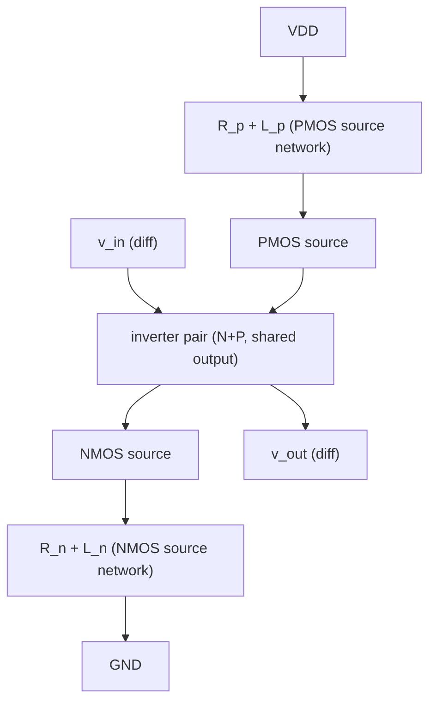

## The problem: peaking and group delay are coupled

In a TIA RF chain you cascade gain stages and lean on peaking (capacitive degeneration, inductive loads) to flatten the magnitude response out to Nyquist. Each peaking element is, in transfer-function terms, a **zero** that lifts the high-frequency gain. But a zero does two things at once: it adds **magnitude** *and* it adds **phase**, and the phase shows up as **group delay** $\tau_g(\omega) = -\,d\phi/d\omega$.

A real (left-half-plane) zero at $\omega_z$ contributes phase $+\arctan(\omega/\omega_z)$. Differentiate and negate:

$$
\tau_{g,\text{zero}}(\omega) = -\frac{d}{d\omega}\arctan\!\left(\frac{\omega}{\omega_z}\right) = -\frac{\omega_z}{\omega_z^2 + \omega^2}
$$

The sign is negative — a zero *advances* the signal, so per-stage it looks like it helps. The trouble is the **shape**: a real zero's delay contribution is most negative near DC and trends back toward zero at high frequency, so across the band the delay has a **positive tilt** (it rises with frequency relative to its low-frequency value). When you stack few stages to get your magnitude boost, those tilts add coherently and you end up with a group-delay profile that ramps upward across the band. That ramp is **deterministic ISI**: different frequency components of the PAM4 edge arrive at different times, the eye's inner levels smear, and vertical eye margin you "won" in magnitude is given back in horizontal/level closure.

> **Concrete framing (the working example for this card).** Target: recover ~6 dB and consider 5 stages in the Main Amplifier, and hold GD pk-pk ≤ 3 ps. The point of the complex zero is not that it magically beats a real zero in every case (see the simulated §7 — for identical stages they can be comparable), but that it gives you a **delay-shaping knob ($Q_z$)** so you can recover the 6 dB *and* place a localized GD correction where the cascade or channel needs it, instead of being locked to whatever delay a real zero hands you.

## 1. Real-zero CTLE: the baseline and its limit

The textbook source-degenerated CTLE (a differential pair with an $R_S \| C_S$ in the tail-split / source path) has the transfer function

$$
H_{\text{RZ}}(s) = \frac{g_m R_D}{1 + g_m R_S/2}\cdot
\frac{1 + s R_S C_S}{\left(1 + s\frac{R_S C_S}{1 + g_m R_S/2}\right)\left(1 + s R_D C_D\right)}
$$

One **real zero** at $\omega_z = 1/(R_S C_S)$, a source-node pole at $\omega_{p1} = (1+g_m R_S/2)/(R_S C_S)$, and the output-load pole at $\omega_{p2} = 1/(R_D C_D)$. The DC gain is degenerated by $1+g_m R_S/2$; the zero/pole ratio sets the peaking. This is the workhorse, and for moderate boost over a wide band it is fine.

Its limitation is exactly the GD tilt above. The single real zero gives a monotonic phase lead whose delay signature can't be localized — you cannot ask a real zero to "boost gain here but give the delay back there." The magnitude and the delay are locked to the same one-parameter ($\omega_z$) family. Push $\omega_z$ down to get more in-band boost and you drag more positive delay tilt into the band with it.

## 2. The complex zero: decoupling magnitude lift from delay shape

A **complex-conjugate zero pair** is a second-order numerator:

$$
N(s) = 1 + \frac{s}{Q_z\,\omega_z} + \frac{s^2}{\omega_z^2}
\quad\Longleftrightarrow\quad
s = \omega_z\left(-\frac{1}{2Q_z} \pm j\sqrt{1 - \frac{1}{4Q_z^2}}\right)
$$

Two parameters now, not one: the natural frequency $\omega_z$ (where the boost lives) **and** the zero-$Q$, $Q_z$ (how peaky and how the phase bends). The magnitude

$$
|N(j\omega)|^2 = \left(1 - \frac{\omega^2}{\omega_z^2}\right)^2 + \frac{1}{Q_z^2}\frac{\omega^2}{\omega_z^2}
$$

has a controllable dip-then-rise: for $Q_z > 1/\sqrt{2}$ it produces a **localized peak** in the boost around $\omega_z$ rather than a monotonic high-pass shelf. That localization is the whole point — you place the gain lift exactly at the band where the core is rolling off, instead of lifting everything above $\omega_z$.

The group-delay payoff is in the phase. The phase of the complex zero is

$$
\phi_N(\omega) = \arctan\!\left(\frac{\omega/(Q_z\omega_z)}{1 - \omega^2/\omega_z^2}\right)
$$

and its delay contribution $-d\phi_N/d\omega$ is **not** monotonic. It has a **band-localized dip** centered near $\omega_z$ whose depth and width are set by $Q_z$. In plain terms: a complex zero can *remove* delay in a chosen band. So you aim each stage's complex zero at the frequency where the cascade's GD is humping up, and the zero's local delay dip cancels the hump. You recover magnitude **and** sculpt delay, because you have two knobs.

### Why this is the natural tool for "positive GD tilt"

Your cascade of real-zero stages produces a delay that rises toward high frequency. A complex zero with appropriately chosen $\omega_z$ (near upper band) and $Q_z$ gives a delay **dip** in that same region. Superpose them and the rising tilt is pulled back flat. You're not fighting the magnitude target to do it — the same zero pair that flattens delay is the one supplying the boost. This is why CZ-CTLE is described as "peaking without compromising GD," and equivalently as a way to "recover positive GD tilt."

The limiting case $Q_z \to \tfrac{1}{2}$ with a matched pole pair is the **all-pass / Bessel-like** regime: flat magnitude, pure delay-shaping. The opposite limit (high $Q_z$) is sharp, narrowband boost. Useful CZ-CTLE design lives between — enough $Q_z$ to localize the boost, not so much that you ring.

## 3. Realization A — RC-degenerated stage with a self-inductance (the cheapest complex zero)

The minimal way to turn the real-zero degeneration into a complex zero is to make the **degeneration impedance itself second-order**. Replace the source/tail $R_S\|C_S$ with an $R_S$–$L_S$–$C_S$ network. The degeneration impedance

$$
Z_S(s) = R_S + sL_S + \frac{1}{sC_S}
\;\Rightarrow\;
\text{a series-RLC} \to \text{complex-zero numerator in } 1/(1+g_m Z_S/2)
$$

makes the effective transconductance $G_m(s) = g_m/(1 + g_m Z_S(s)/2)$ carry a conjugate-zero pair set by $L_S C_S$ (frequency) and $R_S\sqrt{C_S/L_S}$ (damping → $Q_z$). It is the source-degeneration dual of the inductive-peaking trick (see the *Inductive Peaking* card). Cheap, but the inductor sits in the signal path and the $Q_z$ tuning range is limited by what $R_S$ you can afford without re-degenerating the gain.

## 4. Realization B — passive R-L-R differential load (trade DC gain for delay)

Instead of degenerating the source, shape the **load**. Place an **R-L-R network across the differential output** (a resistor to each output node bridged through a series inductor, or an L bridging the two drains with damping resistors). The differential load impedance becomes a second-order function of $s$:

$$
Z_L(s) \;\sim\; R\cdot\frac{1 + s\frac{L}{R'} + s^2 LC_{\text{out}}\cdots}{\cdots}
$$

and the stage transfer function $H = -G_m Z_L(s)$ inherits a complex-zero (or complex pole/zero) pair from the load network. The bridging inductor with its flanking resistors sets the conjugate pair frequency ($\sim 1/\sqrt{LC}$) and damping (the $R$'s). Key properties:

- **Fully passive** — no extra bias current, no added active noise. The complex zero costs silicon area (the inductor) and some **DC gain**, not power.
- **Trades DC gain for GD compensation.** The damping resistors that set $Q_z$ also load the output at DC, so you give up a fraction of the low-frequency gain to buy the delay-flattening zero. In a chain where you have gain to spare (your 5×4 dB stages) this is a good trade: spend ~1 dB of DC gain per stage to keep the delay flat.
- This is the structure behind "passive approach, trading DC gain for GD compensation" and maps onto the **degeneration/load-inductor group-delay-flattening** technique documented for TIAs (e.g. degeneration-inductor networks explicitly used to flatten the GD profile across PVT and bond-wire inductance).

The design move: put one or two of your five stages on R-L-R loads tuned for a delay dip at the top of the band, and leave the others as plain gain. You localize the GD correction where the cascade needs it.

## 5. Realization C — inverter-based active CZ-CTLE with R-L source networks

The most flexible modern realization (and the one in recent inverter-based AFE papers) starts from a **CMOS inverter gain cell** — both NMOS and PMOS contribute $g_m$, good for low-supply, high-$g_m$/power designs — and adds **R-L degeneration at the supply-referred sources**:

An $R\text{-}L$ branch from the **NMOS source to ground** and a mirrored $R\text{-}L$ from the **PMOS source to VDD** make each device's source-degeneration impedance frequency-dependent in a way that injects a **complex zero** into the inverter's effective $G_m(s)$. Mechanism, stage by stage:

- At DC the inductors are shorts, sources sit on $R_n$ / $R_p$ → degenerated gain (well-defined, linear).
- As frequency rises, $sL$ raises the source impedance, *increasing* degeneration — but the $R$–$L$ combination together with the device $C_{gs}$ and the source-node capacitance forms a resonant network whose **zero is complex**. The imaginary part (set by $L$) gives the localized GD dip; the real part (set by $R$) sets $Q_z$.
- Because both N and P sides carry mirrored networks, the complex zero is reinforced differentially and the common-mode is largely unaffected.

Effective single-side picture: with source impedance $Z_{src}(s) = R + sL$ in parallel with the source-node capacitance $C_x$,

$$
G_m(s) = \frac{g_m}{1 + g_m Z_{src}(s)\,\|\,(1/sC_x)}
$$

expand the denominator and you get a numerator (zero) that is second-order in $s$ — i.e. a conjugate zero pair at roughly

$$
\omega_z \approx \frac{1}{\sqrt{L\,C_x}}, \qquad
Q_z \approx \frac{1}{R}\sqrt{\frac{L}{C_x}}\;\;(\text{schematically}).
$$

Advantages of the active inverter-based version:

- **Tunable**: make $R$ (and sometimes $L$ via switched segments or a tunable active inductor) programmable and you get an adjustable $\omega_z$/$Q_z$, so the delay dip can be steered and the boost amplitude trimmed — useful for adaptation across PVT.
- **High $g_m$ per mW** from the inverter (both carriers conduct), which matters when you're adding five stages and watching power.
- **Cost**: the inverter needs a stable common-mode / supply (replica-bias or CM stabilization), and the source inductors are area. Linearity must be watched for PAM4's larger swing.

## 6. Design methodology for the working example

Target: recover ~6 dB and consider 5 stages in the Main Amplifier, and hold GD pk-pk ≤ 3 ps.

1. **Budget the magnitude.** ~1.2 dB boost/stage to undo the 10→4 dB rolloff. That's gentle per-stage peaking → you can run modest $Q_z$, which keeps each stage well-damped and low-ring.
2. **Map the GD hump.** Plot the cascade GD with *real-zero* peaking first. Identify the frequency band where the positive tilt accumulates (usually mid-to-upper band, approaching Nyquist).
3. **Place the complex zeros there.** Choose $\omega_z$ of the CZ stages at/just below the GD hump's center; pick $Q_z$ so the GD dip depth matches the hump height. Start near $Q_z \approx 0.7$–$1.0$ (localized but non-ringing) and tune.
4. **Distribute, don't concentrate.** Spread the complex zeros over 2–3 of the 5 stages rather than one aggressive stage. Distributed lower-$Q_z$ zeros give a smoother composite delay and better PVT robustness than one high-$Q_z$ stage doing all the work.
5. **Mix realizations to taste.** A couple of passive R-L-R load stages (Realization B) for the bulk delay-flattening at no power cost + one tunable active inverter-based stage (Realization C) for adaptation is a pragmatic split. Keep the remaining stages as plain gain.
6. **Verify the composite, not the stage.** GD pk-pk and magnitude flatness are *cascade* properties. Check the end-to-end $\tau_g(\omega)$ and $|H(\omega)|$ to Nyquist (and a bit beyond), and confirm with a PAM4 eye / pulse-response, since GD ripple shows up as level-dependent ISI that a magnitude plot hides.

### Quick numeric intuition

A single real zero at $\omega_z = 2\pi\cdot 30$ GHz contributes, at low frequency, a delay of about $-1/\omega_z \approx -5.3$ ps that *relaxes toward 0* by Nyquist — i.e. ~5 ps of **positive swing** across the band, per stage. Five stages → tens of ps of tilt if uncorrected (far past your 3 ps budget). A complex zero of the same $\omega_z$ with $Q_z\approx 1$ replaces that monotonic relaxation with a localized dip of comparable magnitude *centered* in-band, so the across-band swing is a fraction of the real-zero case — which is exactly how the 3 ps budget is held while the 6 dB is recovered. (Plug your real poles/zeros into a quick symbolic sweep to get the exact numbers for your stage values; the `scripts/` folder is the place for it.)

## 7. Worked example — simulated (the figures)

`scripts/cz_ctle_demo.py` builds exactly the scenario above — $H_{\text{core}}$ as a 2-pole low-pass with ~10 dB rolloff at 56 GHz, then five cascaded equalizer stages, tuned (by root-finding the zero frequency) so **both** cases land at the *same* ~4 dB residual at Nyquist. With magnitude held equal, the plots isolate the group delay.

Both cascades hit −4 dB at Nyquist by construction. Note the complex-zero trace (blue) shows its **localized** character — a gentle boost that peaks near the upper band and even dips slightly at Nyquist — versus the real-zero's broader high-pass lift.

**An honest result, and an important one.** For this *identical-stage, DC-normalized* cascade, the real-zero case does **not** come out dramatically worse — in fact here it slightly *reduces* the core's GD hump, because a zero-pole pair is partly self-compensating and the bulk delay is removed by normalization. So the naive story "real zero always ruins GD, complex zero always fixes it" is too strong. The truthful statement is narrower: **the complex zero gives you an extra knob ($Q_z$) that the real zero does not**, and what that knob buys you is *control* — including the ability to place a localized GD correction exactly where a real channel humps.

This is the real lesson. **Every curve is tuned to the same −4 dB at Nyquist** (left panel — they all cross at 56 GHz), yet the group delay (right panel) is completely different: a well-damped zero ($Q_z\approx0.5$–$0.6$) gives a controlled ~5–6 ps spread, while pushing $Q_z$ up to 1.0–1.3 makes the *same magnitude boost* ring, with the GD plunging to a 20–37 ps dip. The conjugate zero's imaginary part is a delay-shaping degree of freedom — use it at low-to-moderate $Q_z$, and **never** chase magnitude peaking with high $Q_z$ unless you have budget for the GD excursion.

> **Caveat on the demo vs. silicon.** These are idealized lumped pole/zero models with identical stages and DC normalization. The clearest real-world CZ-CTLE win appears against a **channel/core with a pronounced GD hump localized in a specific band** (where the conjugate zero drops its dip exactly there, something a single real zero cannot localize), and when stages are **individually tuned** rather than identical. Re-run the script with your extracted $H_{\text{core}}$ and per-stage values to see where your design actually lands. Tweak the core ($f_p$, $q$), the pole ratios, and $Q_z$ at the top of `main()`.

## Key takeaways

- A **real zero** couples magnitude boost to a **monotonic positive GD tilt**; cascading peaking stages accumulates that tilt into deterministic ISI.
- A **complex-conjugate zero** has two knobs — $\omega_z$ (where) and $Q_z$ (how peaky / how the phase bends) — so it can **localize** the boost and produce a **band-localized GD dip** that cancels the cascade's hump.
- Three realizations: **(A)** $R$-$L$-$C$ source degeneration (cheap, limited tuning); **(B)** passive **R-L-R differential load** — fully passive, **trades DC gain** for delay-flattening, no added noise/power; **(C)** **inverter-based active CZ** with $R$-$L$ networks from NMOS-source-to-GND and PMOS-source-to-VDD — high $g_m$/power and **tunable** $\omega_z$/$Q_z$, at the cost of CM/supply stabilization and area.
- Methodology: budget gentle per-stage boost, map where the GD humps, place distributed complex zeros ($Q_z\!\approx\!0.7$–$1$) there, mix passive + active realizations, and verify the **cascade** GD/eye — not the per-stage response.

> Architectures corroborated by inverter-based PAM4 CTLE/AFE work using source-side passives for peaking (e.g. eSilicon 56 Gb/s PAM4 AFE, Pisati et al., ISSCC 2019) and by TIA degeneration-inductor networks explicitly used to flatten the group-delay profile across PVT and bond-wire inductance. The transfer-function and group-delay relations here are standard first-principles forms; tune the pole/zero/$Q_z$ values against your extracted stage models.
